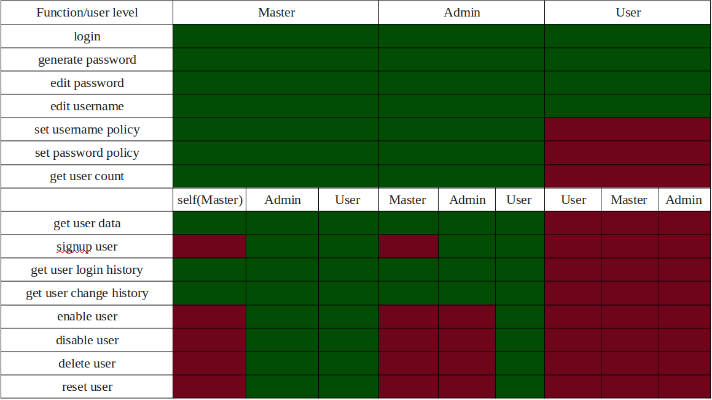

#               Password-Management-System
###             System to manage user account
___

API Cheatsheet:

create user:
curl -X POST -H "Content-Type:application/json" http://127.0.0.1:1337/signup -d'{"admin_username":"Amino1","admin_password":"h]XN^3+R8s","username":"ASu3w2","password":"h&5s§!/2S)JhGBV","status":true,"admin":true}'

login:
curl -X GET -H 'Content-Type: application/json' http://127.0.0.1:1337/login -d '{"username":"Amino1","password":"h]XN^3+R8s"}'

curl -X GET -H 'Content-Type: application/json' http://127.0.0.1:1337/login -d '{"username":"ASu3w2","password":"h]XN^3+R8s"}'

generate password:
curl -X GET -H 'Content-Type: application/json' http://127.0.0.1:1337/generate-password -d '{"username":"Amino1","password":"h]XN^3+R8s","length":20}'

edit password:
curl -X PUT -H 'Content-Type: application/json' http://127.0.0.1:1337/edit-password -d '{"username":"ASu3w2","password":"4{!@q1N9","new":"h]XN^3+R8s"}'

edit username:
curl -X PUT -H 'Content-Type: application/json' http://127.0.0.1:1337/edit-username -d '{"username":"Amino1","password":"h]XN^3+R8s","new":"loasd1§A"}'

enable user:
curl -X PUT -H 'Content-Type: application/json' http://127.0.0.1:1337/admin/enable-user -d '{"username":"Amino1","password":"h]XN^3+R8s","user":"ASu3w2"}'

disable user:
curl -X PUT -H 'Content-Type: application/json' http://127.0.0.1:1337/admin/disable-user -d '{"username":"amin","password":"h]XN^3+R8s","user":"abdul"}'

delete user:
curl -X DELETE -H 'Content-Type: application/json' http://127.0.0.1:1337/admin/delete-user -d '{"username":"Amino1","password":"h]XN^3+R8s","user":"ASu3w2"}'

reset user's password:
curl -X PUT -H 'Content-Type: application/json' http://127.0.0.1:1337/admin/reset-user -d '{"username":"Amino1","password":"h]XN^3+R8s","user":"ASu3w2"}'

set password policy:
curl -X PUT -H 'Content-Type: application/json' http://127.0.0.1:1337/admin/set-password-policy -d '{"username":"Amino1","password":"A+2-0n)051","minlength":8,"maxlength":60,"upper":1,"lower":1,"numeric":2,"punctuation":1}'

set username policy:
curl -X PUT -H 'Content-Type: application/json' http://127.0.0.1:1337/admin/set-username-policy -d '{"username":"Amino1","password":"A+2-0n)051","minlength":4,"maxlength":14,"upper":1,"lower":1,"numeric":3,"punctutation":1}'

get user data:
curl -X GET -H 'Content-Type: application/json' http://127.0.0.1:1337/admin/get-user-data -d '{"username":"Amino1","password":"A+2-0n)051","user":"Ap23"}'

get user count:
curl -X GET -H 'Content-Type: application/json' http://127.0.0.1:1337/admin/get-user-count -d '{"username":"Amino1","password":"h]XN^3+R8s"}'

get user login history:
curl -X GET -H 'Content-Type: application/json' http://127.0.0.1:1337/admin/get-user-login-history -d '{"username":"Amino1","password":"h]XN^3+R8s","user":"ASu3w2"}'

get user change history:
curl -X GET -H 'Content-Type: application/json' http://127.0.0.1:1337/admin/get-user-change-history -d '{"username":"Amino1","password":"A+2-0n)051","user":"Ap23"}'

sudo -u postgres -s
username: sonarqube
password: abc12345.
https://techexpert.tips/sonarqube/sonarqube-installation-ubuntu-linux/

talk about linting
talk about time class , behavior oriented class
overwriting the typeerror class
own error classes
writting files, with finally, try except, in try read the file in var, if except do anything then in finally write the data
working always with type hinting
using inharitance
documentation with google style of docstrings
make a done list at the end of the pms to show which requirments are done by the system, which are required by schaad